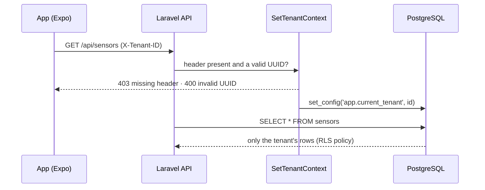

# PgSaaS Core

[Português](README.md) · **English**

A multi-tenant SaaS backend where isolation between customers is enforced by PostgreSQL itself (Row-Level Security), with time-series ingestion into partitioned tables and a mobile app to watch latency and load in real time.


<p align="center">
  
  <br>
  <em>PgSaaS Monitor during a load test: 1,200 writes/s with reads at ~12 ms.</em>
</p>

---

## Overview

The project simulates an IoT data ingestion engine (e.g., industrial or fuel pump sensors) where many customers share the same database. The core question is: **how do you guarantee that a customer never sees another customer's data, even when the application gets it wrong?**

The answer taken here is to move that responsibility from the application to the database. Every request sets the tenant on the PostgreSQL session, and RLS policies filter every read and write. If a developer forgets a `where tenant_id = ?`, the database still blocks the access.

## Highlights

- **Database-level isolation (RLS):** `USING` and `WITH CHECK` policies on `sensors` and `sensor_readings`, with `FORCE ROW LEVEL SECURITY` so not even the table owner bypasses them.
- **Monthly partitioning:** `sensor_readings` is partitioned by `created_at` (24 monthly partitions plus a `DEFAULT` one), so time-bounded queries only touch the partitions they need.
- **Covering index:** `(tenant_id, created_at DESC) INCLUDE (value)` enables index-only scans for analytical queries.
- **Per-tenant cache:** stats are cached in Redis with per-tenant tags and a 2 s TTL.
- **In-database load test:** a stored procedure inserts batches of readings under RLS, triggered from the app.
- **CI against a real Postgres:** GitHub Actions starts PostgreSQL 16, creates a **non-superuser** role (superusers bypass RLS), and runs the migrations and the isolation tests.
- **OpenAPI docs** generated from annotations (Swagger).

## How isolation works



The policy applied to both tables:

```sql
CREATE POLICY tenant_isolation_policy ON sensor_readings
USING      (tenant_id = NULLIF(current_setting('app.current_tenant', true), '')::uuid)
WITH CHECK (tenant_id = NULLIF(current_setting('app.current_tenant', true), '')::uuid);
```

With no tenant set, the comparison evaluates to `NULL` and no rows are returned. `NULLIF` covers the case where the setting was reset and comes back as an empty string.

## Case study: a cast that disabled the index

The first version of the policy compared `tenant_id::text = current_setting(...)`. It worked, but the cast on the column prevented PostgreSQL from using `tenant_id` in the index. With the database idle and about 120k rows in the current month's partition, the latency query plan was:

```
Index Scan using sensor_readings_2026_09_tenant_id_created_at_idx
  Index Cond: (created_at >= '...')
  Filter: ((tenant_id)::text = current_setting('app.current_tenant', true))
Planning Time: 8.759 ms   Execution Time: 3.654 ms
```

The index only narrowed the time range. Recent rows from **every** tenant were read and discarded one by one, and that cost grew exactly when load tests were running.

The fix was to compare using the column's own type (migration `fix_rls_policies_use_uuid_comparison`):

```
Index Only Scan using sensor_readings_2026_09_tenant_id_created_at_value_idx
  Index Cond: ((tenant_id = (NULLIF(current_setting(...), ''))::uuid) AND (created_at >= '...'))
Planning Time: 0.666 ms   Execution Time: 0.858 ms
```

Both filters now go into the index and the query never touches the table heap. Since the value is now cast to `uuid` in the database, the middleware also validates the header and returns `400` for invalid values instead of letting the error surface as a `500`.

In the same round, the Docker setup gained a named volume for `vendor/`. On Windows with WSL2, the project folder is mounted through a slow filesystem (9p), and loading Laravel's thousands of classes through it added tens of milliseconds to every request.

With both changes, the latency measured by the app under load dropped from about **150 ms** to the **12–24 ms** range.

## Monitoring app

The app (Expo / React Native) is the window into how the system behaves:

- **Tenant:** switches the RLS context and shows the current value of `app.current_tenant`.
- **Read latency:** duration of the read query as measured by the backend, with p50 and p95 over a 60 s window and a status: healthy below 50 ms, degraded up to 200 ms and critical above that.
- **Last 60 seconds chart:** read latency over writes per second, drawn with SVG.
- **Storage:** the active partition and the total rows **visible to the tenant**, i.e. already filtered by RLS.
- **Load test:** inserts 1,000 rows per second into the tenant's partition for 30 s.

### Database metrics under load


*pgAdmin dashboard during four load tests: the insert blocks under "Tuples in" are the app's batches.*

## Stack

| Layer | Technologies |
|---|---|
| API | PHP 8.2, Laravel 12, Sanctum, L5-Swagger |
| Database | PostgreSQL 16 (RLS, declarative partitioning, covering indexes, PL/pgSQL) |
| Cache | Redis (Predis) |
| App | Expo SDK 54, React Native, TypeScript, react-native-svg |
| Infra | Docker Compose (PHP-FPM, Nginx, PostgreSQL, Redis, pgAdmin) |
| CI | GitHub Actions |

## Getting started

**Prerequisites:** Docker (on Windows, Docker Desktop with WSL2), Node.js 20+, and an Android emulator or a phone with Expo Go.

### 1. Backend

```bash
git clone https://github.com/Leo-o-Nardo/postgres-rls-multitenancy.git
cd postgres-rls-multitenancy
cp backend/.env.docker.example backend/.env

docker compose up -d --build
docker compose run --rm app composer install
docker compose run --rm app php artisan key:generate
docker compose run --rm app php artisan migrate       # tables, RLS policies and partitions
docker compose run --rm app php artisan db:seed       # 2 tenants, 10 sensors, 100k readings
docker compose run --rm app php artisan l5-swagger:generate
```

| Service | URL |
|---|---|
| API | http://localhost:8000/api/ping |
| Swagger | http://localhost:8000/api/documentation |
| pgAdmin | http://localhost:8080 (login `admin@admin.com` / `root`) |

In pgAdmin, register the server with host `db`, port `5432`, user `app_user` and password `app_password`. Use this role rather than `postgres`: superusers bypass RLS and see every tenant's data.

### 2. App

```bash
cd frontend
cp .env.example .env    # adjust EXPO_PUBLIC_API_URL when using a physical device
npm install
npx expo start          # press "a" to open it on the Android emulator
```

On the Android emulator, `10.0.2.2` points to the host machine. On a physical device, use your machine's LAN IP.

## Tests

```bash
docker compose run --rm app php artisan test
```

```
PASS  Tests\Feature\TenantSecurityTest
✓ tenant can only see their own sensors
✓ request without header is blocked
✓ request with invalid tenant id is rejected
```

The isolation test creates data for two tenants and checks, through the API, that each one only sees its own sensors. The route has no tenant filter in code: the database does the filtering.

## API

All routes live under `/api`. Routes marked below require an `X-Tenant-ID` header with the tenant's UUID.

| Method | Route | Tenant | Description |
|---|---|---|---|
| `GET` | `/ping` | | Health check |
| `GET` | `/tenants` | | Lists tenants (id and name) |
| `GET` | `/sensors` | ✓ | The tenant's sensors |
| `POST` | `/stress/start` | ✓ | Inserts `amount` readings (default 100) through a stored procedure |
| `GET` | `/stress/stats` | ✓ | Read latency, writes/s, visible rows and active partition |

## Project structure

```text
├── docker-compose.yml        # PHP-FPM, Nginx, PostgreSQL, Redis and pgAdmin
├── docker/                   # Nginx config and Postgres init script
├── backend/                  # Laravel 12 API
│   ├── app/Http/Middleware/  # SetTenantContext: sets the tenant on the DB session
│   ├── database/migrations/  # tables, RLS policies, partitions and load procedure
│   └── tests/Feature/        # isolation tests
├── frontend/                 # Expo app (PgSaaS Monitor)
│   ├── app/                  # screen
│   ├── components/           # chart, cards, tenant picker
│   ├── hooks/                # metrics polling and load test
│   └── lib/api.ts            # HTTP client
└── .github/workflows/        # CI
```

## Author

**Leonardo Ferreira** · [LinkedIn](https://www.linkedin.com/in/leonardo-ferreira-de-souza/) · [GitHub](https://github.com/Leo-o-Nardo)
