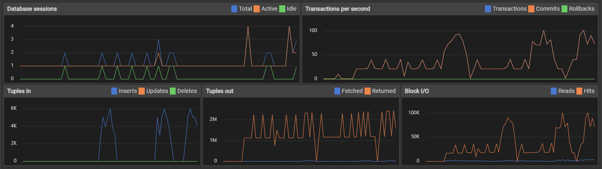
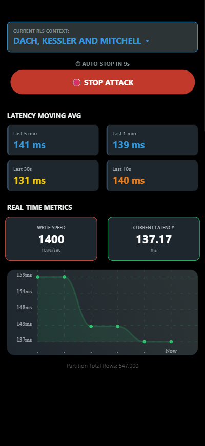

# PgSaaS Core
**High-Performance Multi-Tenant SaaS Architecture**


---

## 📖 Overview

**PgSaaS Core** is a technical case study that demonstrates how to design a **secure, scalable, and observable multi-tenant SaaS platform**, with a strong focus on **database-centric architecture**.

The system simulates a high-volume **IoT data ingestion engine** (e.g., industrial or fuel pump sensors), processing large time-series datasets while enforcing **strict tenant isolation directly at the PostgreSQL level**.

Beyond the backend, the project includes a **full-stack ecosystem**, featuring a mobile observability application, distributed caching with Redis, automated CI/CD pipelines, and self-generated API documentation.

---

## 🎯 Key Goals

- **Security:** Enforce multi-tenancy using PostgreSQL Row-Level Security (RLS)
- **Performance:** Handle large-scale time-series data via native partitioning and indexing
- **Scalability:** Reduce read pressure using Redis look-aside caching
- **Observability:** Provide real-time operational visibility through a mobile dashboard
- **Quality Assurance:** Validate guarantees with automated tests and CI pipelines

---

## 🚀 Core Features

### 🔐 1. Database-Level Multi-Tenancy (RLS)

Tenant isolation is enforced using **PostgreSQL Row-Level Security policies**.

Even if the application layer:
- Forgets to apply a tenant filter
- Executes an incorrect or overly broad query

👉 PostgreSQL itself blocks cross-tenant access.

**Implementation details:**
- A Laravel middleware injects `app.current_tenant` into the DB session
- Policies are evaluated at query execution time

**Result:** Strong isolation guarantees independent of application correctness.

---

### ⚡ 2. High-Performance Time-Series Storage

Sensor data is stored using **range partitioning by month**.

**Optimizations:**
- Partition pruning for bounded time queries
- Covering indexes (`INCLUDE`) for analytical workloads
- BRIN indexes for large, append-only datasets

**Result:** Predictable query performance even with millions of rows.

> **Snapshot:** Database metrics showing stable transaction throughput during massive data ingestion.


---

### 📱 3. Mobile Observability Application (React Native)

A companion mobile application built with **Expo / React Native** provides operational visibility.

**Capabilities:**
- Switch tenant context to visually validate RLS enforcement
- Display ingestion throughput and query latency
- Trigger controlled load scenarios to observe system behavior

The mobile app acts as a **read-only control surface**, consuming pre-aggregated backend metrics.

<p align="center">
  
  <br>
  <em>Real-time latency monitoring and load control via Mobile App</em>
</p>

---

### 🚀 4. Distributed Caching with Redis

The backend uses a **look-aside caching strategy** with Redis.

**Design considerations:**
- Cache keys are namespaced per tenant
- Heavy analytical queries are cached independently
- Cache invalidation is tied to batch processing events

**Result:** Improved read scalability and isolation between tenants under load.

---

### 🤖 5. CI/CD, Automation, and API Documentation

- **GitHub Actions:** Automatically spins up PostgreSQL and runs security-focused test suites on every push
- **OpenAPI / Swagger:** API documentation is generated directly from Laravel annotations, providing a live interactive playground

---

## 🏗 Architecture Decisions

### Database-Enforced Security over Application Trust

Multi-tenancy is enforced at the storage layer using RLS.  
The application is treated as **untrusted**, reducing the blast radius of bugs and regressions.

---

### Native Partitioning with Index-Only Queries

Time-series scalability is achieved through:
- Declarative partitioning
- Covering indexes enabling index-only scans
- Minimal reliance on application-side aggregation

---

### Controlled Load and Backpressure Awareness

The frontend avoids fixed polling intervals and adapts request cadence dynamically, preventing UI degradation during high-latency periods.

---

## 🛠 Installation & Setup

### Prerequisites
- Docker
- Docker Compose
- Node.js (for the mobile application)

### 1. Clone the Repository

```bash
git clone https://github.com/Leo-o-Nardo/pg-saas-core.git
cd pg-saas-core
```

### 2. Start the Environment

```bash
docker-compose up -d
```

---

### 3. Install Dependencies and Initialize the Database

Run the following commands inside the application container:

```bash
# Install PHP dependencies
docker-compose run --rm app composer install

# Fix permissions
docker-compose run --rm app chmod -R 775 storage bootstrap/cache

# Run migrations (schemas, RLS policies, partitions)
docker-compose run --rm app php artisan migrate

# (Optional) Seed sample tenants and sensors
docker-compose run --rm app php artisan db:seed

# Generate API documentation
docker-compose run --rm app php artisan l5-swagger:generate
#API Docs available at: http://localhost:8000/api/documentation
```

To run the frontend application locally, execute the following commands from the project root:
```bash
# Navigate to the frontend directory
cd frontend

# Install dependencies
npm install

# Start the Expo development server
npx expo start
```

---

## 🧪 Testing & Validation

The test suite explicitly validates tenant isolation.

```bash
docker-compose run --rm app php artisan test
```

Expected output:

```
PASS  Tests\Feature\TenantSecurityTest
✓ tenant can only see their own data
✓ cross-tenant access is blocked by PostgreSQL
```

These tests intentionally attempt to bypass application-level logic to prove that **PostgreSQL enforces isolation**.

---

## 📂 Project Structure

```text
├── docker-compose.yml     # Environment orchestration
├── docker/                # Nginx & PHP configuration
├── backend/               # Laravel 11 API
│   ├── app/               # Controllers, middleware, services
│   ├── database/          # Migrations, RLS policies, partitions
│   └── tests/             # Security and regression tests
├── frontend/              # React Native (Expo) application
└── .github/workflows/     # CI/CD pipelines
```

---

## 👤 Author

**Leonardo Ferreira**  
Full Stack Developer 
