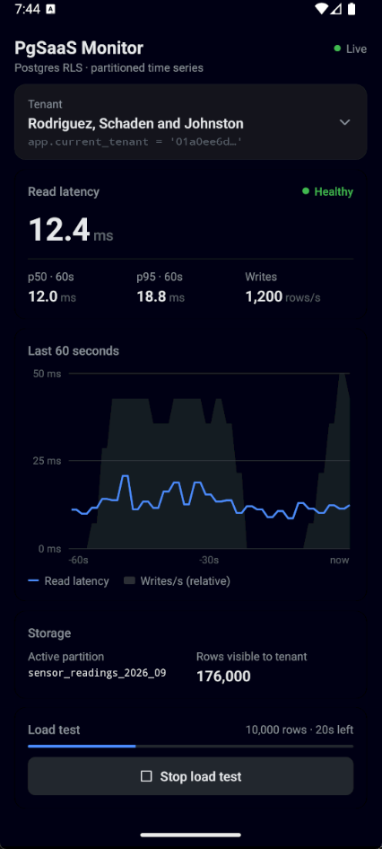
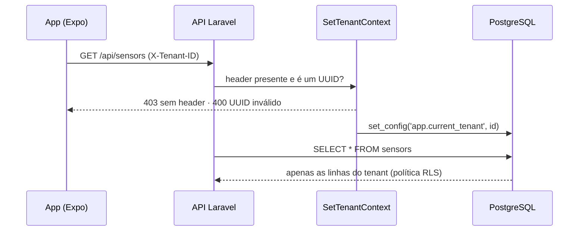
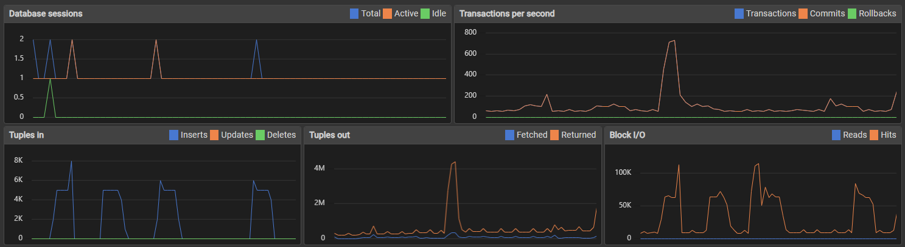

# PgSaaS Core

**Português** · [English](README.en.md)

Backend SaaS multi-tenant em que o próprio PostgreSQL controla o isolamento entre os clientes usando Row-Level Security (RLS). O projeto também trabalha com ingestão de dados em tabelas particionadas e possui um app mobile para acompanhar a latência e a carga em tempo real.


<p align="center">
  
  <br>
  <em>PgSaaS Monitor durante um teste de carga: 1.200 escritas/s com leitura em ~12 ms.</em>
</p>

---

## Visão geral

A ideia do projeto é simular um sistema de ingestão de dados de sensores IoT, como sensores industriais ou de bombas de combustível, onde vários clientes usam o mesmo banco de dados.

O principal problema é garantir que um cliente nunca consiga acessar os dados de outro, mesmo que exista algum erro na aplicação.

Para resolver isso, o isolamento não fica somente por conta da aplicação. O próprio PostgreSQL faz esse controle usando RLS.

A cada requisição, o tenant é definido na sessão do PostgreSQL e as políticas de RLS controlam as leituras e escritas. Assim, mesmo que alguém esqueça um `where tenant_id = ?` na aplicação, o banco continua impedindo o acesso aos dados de outro tenant.

## Principais pontos

- **Isolamento no banco (RLS):** as tabelas `sensors` e `sensor_readings` usam políticas `USING` e `WITH CHECK`, além de `FORCE ROW LEVEL SECURITY`.
- **Particionamento por mês:** `sensor_readings` é particionada por `created_at`, com 24 partições mensais e uma `DEFAULT`. Nas consultas com filtro de data, o PostgreSQL consegue acessar somente as partições necessárias.
- **Índice de cobertura:** o índice `(tenant_id, created_at DESC) INCLUDE (value)` permite que algumas consultas sejam atendidas diretamente pelo índice, usando *index-only scans*.
- **Cache por tenant:** as estatísticas ficam em Redis, separadas por tenant e com TTL de 2 segundos.
- **Teste de carga:** uma *stored procedure* insere os lotes de leituras respeitando o RLS. O processo é disparado pelo app.
- **CI com PostgreSQL real:** o GitHub Actions sobe um PostgreSQL 16, cria um usuário **sem** privilégio de superusuário e executa as migrations e os testes de isolamento. Isso é importante porque superusuários ignoram o RLS.
- **Documentação OpenAPI** gerada a partir das anotações do Swagger.

## Como funciona o isolamento


```mermaid
sequenceDiagram
    participant App as App (Expo)
    participant API as API Laravel
    participant MW as SetTenantContext
    participant PG as PostgreSQL

    App->>API: GET /api/sensors (X-Tenant-ID)
    API->>MW: header presente e é um UUID?
    MW-->>App: 403 sem header · 400 UUID inválido
    MW->>PG: set_config('app.current_tenant', id)
    API->>PG: SELECT * FROM sensors
    PG-->>API: apenas as linhas do tenant (política RLS)
```

A política usada nas duas tabelas é:

```sql
CREATE POLICY tenant_isolation_policy ON sensor_readings
USING      (tenant_id = NULLIF(current_setting('app.current_tenant', true), '')::uuid)
WITH CHECK (tenant_id = NULLIF(current_setting('app.current_tenant', true), '')::uuid);
```

Quando nenhum tenant está definido, a comparação resulta em `NULL` e nenhuma linha é retornada. O `NULLIF` também trata o caso em que a variável foi resetada e voltou como uma string vazia.

## Um problema de performance causado pelo cast

Na primeira versão, a política comparava `tenant_id::text = current_setting(...)`. A consulta funcionava, mas o *cast* feito na coluna impedia o PostgreSQL de usar `tenant_id` corretamente no índice.

Com o banco parado e cerca de 120 mil linhas na partição do mês, o plano da consulta de latência era:

```
Index Scan using sensor_readings_2026_09_tenant_id_created_at_idx
  Index Cond: (created_at >= '...')
  Filter: ((tenant_id)::text = current_setting('app.current_tenant', true))
Planning Time: 8.759 ms   Execution Time: 3.654 ms
```

Nesse caso, o índice estava sendo usado apenas para filtrar pelo tempo. As linhas recentes de **todos** os tenants eram lidas e depois descartadas uma a uma.

Durante os testes de carga, esse custo aumentava bastante.

A correção foi fazer a comparação usando o mesmo tipo da coluna, na migration `fix_rls_policies_use_uuid_comparison`:

```
Index Only Scan using sensor_readings_2026_09_tenant_id_created_at_value_idx
  Index Cond: ((tenant_id = (NULLIF(current_setting(...), ''))::uuid) AND (created_at >= '...'))
Planning Time: 0.666 ms   Execution Time: 0.858 ms
```

Depois da alteração, os dois filtros passaram a fazer parte do índice e a consulta nem precisa acessar a tabela.

Como o valor também passou a ser convertido para `uuid` no banco, o middleware passou a validar o header antes e retornar `400` quando o tenant informado é inválido, em vez de deixar isso virar um `500`.

Nesse mesmo ajuste, o Docker passou a usar um volume nomeado para `vendor/`.

No Windows com WSL2, a pasta do projeto fica em um sistema de arquivos mais lento (9p). Como o Laravel precisa carregar milhares de classes, isso estava adicionando dezenas de milissegundos em cada requisição.

Com essas duas mudanças, a latência medida pelo app durante os testes de carga caiu de cerca de **150 ms** para a faixa de **12 a 24 ms**.

## App de monitoramento

O app em Expo / React Native serve para acompanhar o comportamento do sistema:

- **Tenant:** permite trocar o tenant e mostra o valor atual de `app.current_tenant`.
- **Read latency:** mostra o tempo das consultas de leitura medido no backend, com p50 e p95 dos últimos 60 segundos. Também mostra um status: saudável abaixo de 50 ms, atenção até 200 ms e crítico acima disso.
- **Gráfico dos últimos 60 s:** mostra a latência de leitura junto com a quantidade de escritas por segundo, usando SVG.
- **Storage:** mostra a partição ativa e a quantidade de linhas **visíveis para o tenant**, já considerando o filtro do RLS.
- **Load test:** insere 1.000 linhas por segundo na partição do tenant durante 30 segundos.

### Métricas do banco durante a carga



*Dashboard do pgAdmin durante quatro testes de carga: os blocos de inserts em "Tuples in" são os lotes do app.*

## Stack

| Camada | Tecnologias |
|---|---|
| API | PHP 8.2, Laravel 12, Sanctum, L5-Swagger |
| Banco | PostgreSQL 16 (RLS, particionamento declarativo, índices de cobertura, PL/pgSQL) |
| Cache | Redis (Predis) |
| App | Expo SDK 54, React Native, TypeScript, react-native-svg |
| Infra | Docker Compose (PHP-FPM, Nginx, PostgreSQL, Redis, pgAdmin) |
| CI | GitHub Actions |

## Como rodar

**Pré-requisitos:** Docker (no Windows, Docker Desktop com WSL2), Node.js 20+ e um emulador Android ou celular com Expo Go.

### 1. Backend

```bash
git clone https://github.com/Leo-o-Nardo/postgres-rls-multitenancy.git
cd postgres-rls-multitenancy
cp backend/.env.docker.example backend/.env

docker compose up -d --build
docker compose run --rm app composer install
docker compose run --rm app php artisan key:generate
docker compose run --rm app php artisan migrate       # tabelas, políticas RLS e partições
docker compose run --rm app php artisan db:seed       # 2 tenants, 10 sensores, 100 mil leituras
docker compose run --rm app php artisan l5-swagger:generate
```

| Serviço | Endereço |
|---|---|
| API | http://localhost:8000/api/ping |
| Swagger | http://localhost:8000/api/documentation |
| pgAdmin | http://localhost:8080 (login `admin@admin.com` / `root`) |

No pgAdmin, cadastre o servidor com host `db`, porta `5432`, usuário `app_user` e senha `app_password`. Use esse usuário, e não o `postgres`: superusuários ignoram o RLS e enxergam os dados de todos os tenants.

### 2. App

```bash
cd frontend
cp .env.example .env    # ajuste EXPO_PUBLIC_API_URL se usar um celular físico
npm install
npx expo start          # pressione "a" para abrir no emulador Android
```

No emulador Android, `10.0.2.2` aponta para a máquina host. Em um celular físico, use o IP da sua máquina na rede local.

## Testes

```bash
docker compose run --rm app php artisan test
```

```
PASS  Tests\Feature\TenantSecurityTest
✓ tenant can only see their own sensors
✓ request without header is blocked
✓ request with invalid tenant id is rejected
```

O teste de isolamento cria dados para dois tenants e verifica pela API que cada um consegue enxergar somente os próprios sensores.

Não existe um filtro por tenant no código da rota. Quem faz esse controle é o próprio banco.

## API

Todas as rotas abaixo de `/api`. As rotas marcadas exigem o header `X-Tenant-ID` com o UUID do tenant.

| Método | Rota | Tenant | Descrição |
|---|---|---|---|
| `GET` | `/ping` | | Health check |
| `GET` | `/tenants` | | Lista os tenants (id e nome) |
| `GET` | `/sensors` | ✓ | Sensores do tenant |
| `POST` | `/stress/start` | ✓ | Insere `amount` leituras (padrão 100) via *stored procedure* |
| `GET` | `/stress/stats` | ✓ | Latência de leitura, escritas/s, linhas visíveis e partição ativa |

## Estrutura

```text
├── docker-compose.yml        # PHP-FPM, Nginx, PostgreSQL, Redis e pgAdmin
├── docker/                   # Nginx e script de inicialização do Postgres
├── backend/                  # API Laravel 12
│   ├── app/Http/Middleware/  # SetTenantContext: define o tenant na sessão do banco
│   ├── database/migrations/  # tabelas, políticas RLS, partições e procedure de carga
│   └── tests/Feature/        # testes de isolamento
├── frontend/                 # app Expo (PgSaaS Monitor)
│   ├── app/                  # tela
│   ├── components/           # gráfico, cartões, seletor de tenant
│   ├── hooks/                # polling de métricas e teste de carga
│   └── lib/api.ts            # cliente HTTP
└── .github/workflows/        # CI
```

## Autor

**Leonardo Ferreira** · [LinkedIn](https://www.linkedin.com/in/leonardo-ferreira-de-souza/) · [GitHub](https://github.com/Leo-o-Nardo)
